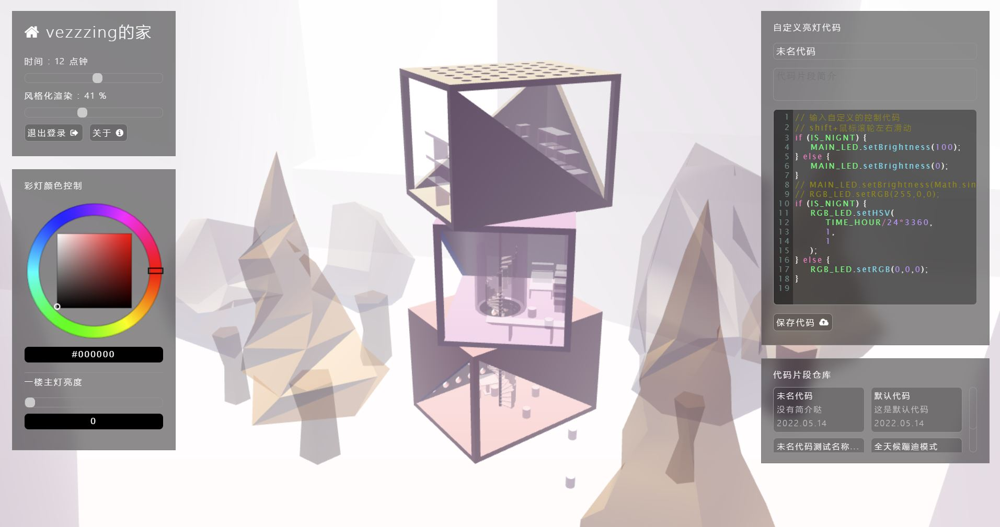
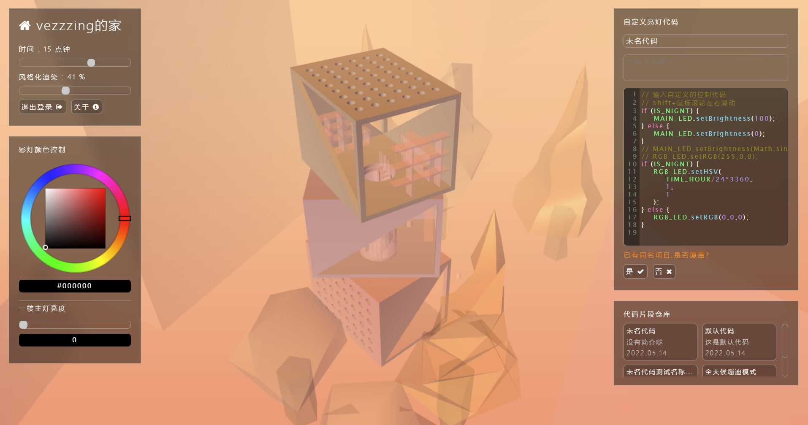
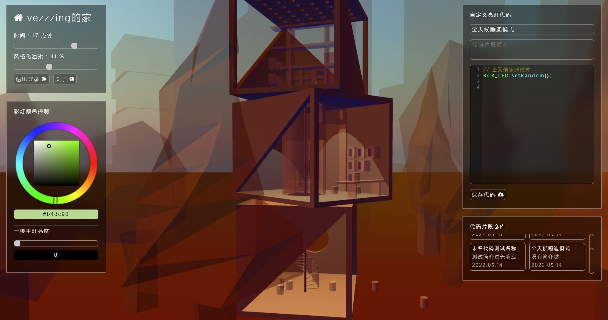
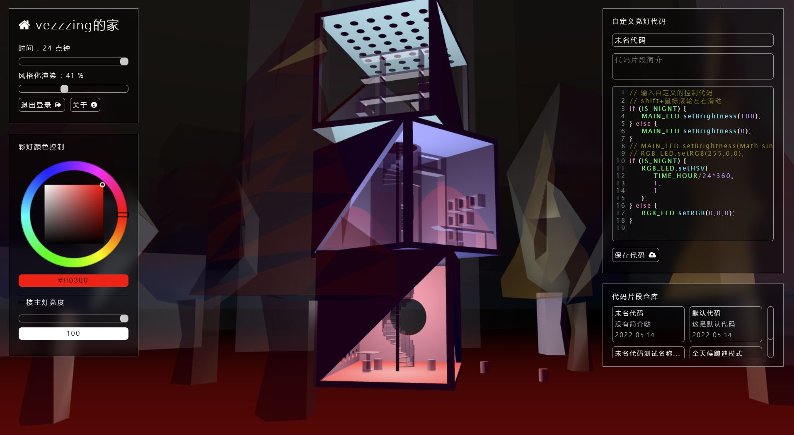
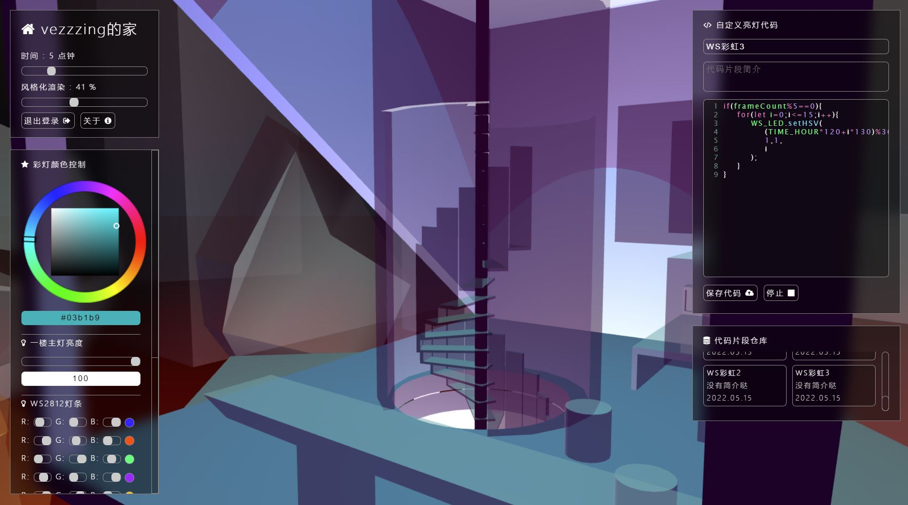
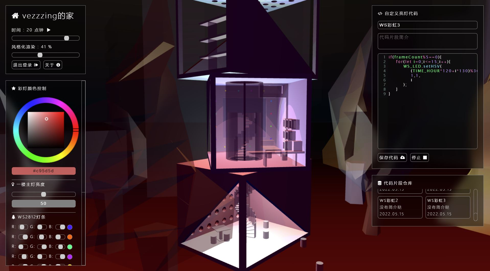
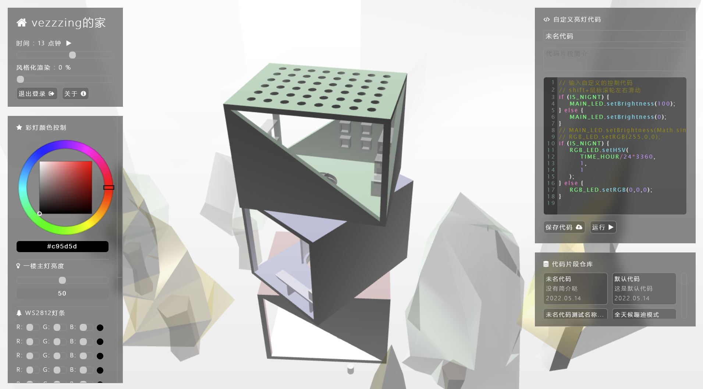
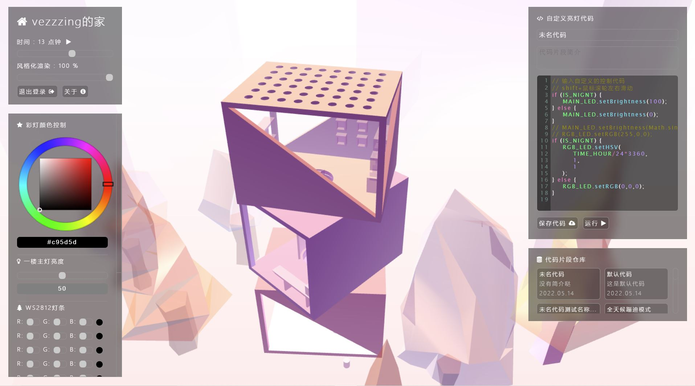
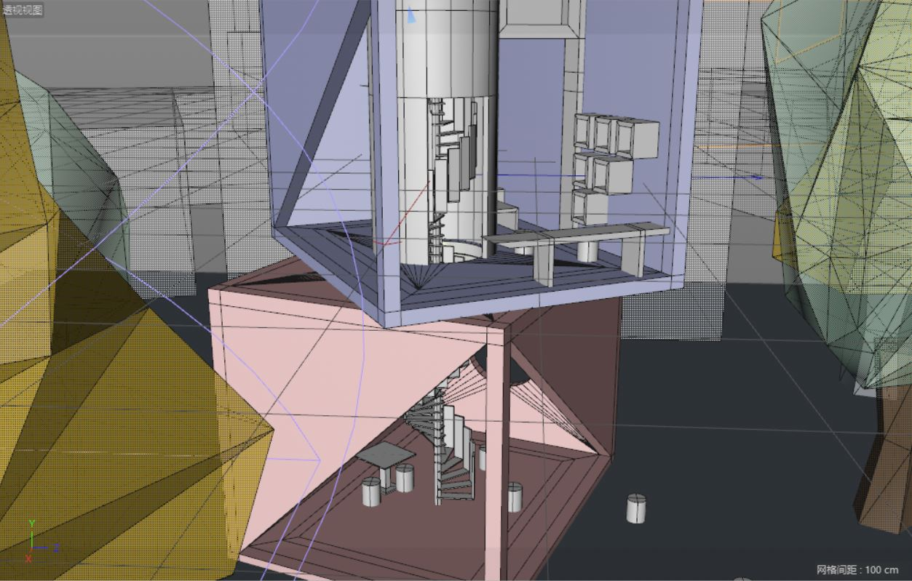
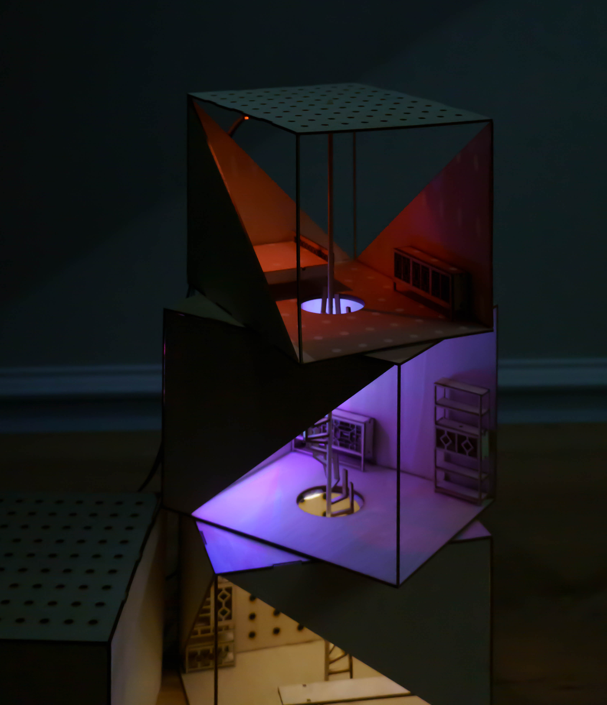

# 标题待定

Respberry 'smart' house ControlSystem
一个通过 JS 控制硬件的平台
by vezzzing

---


智能硬件这门课后三周的作业。

平台-界面-软件-硬件

技术栈的方面，这是第二次尝试前后端完全分离的项目，Vue 和 Axios 大大简化了前端对于底层的操作【第一次做前后端完全分离手搓底层 js 和 DOM xhr 发指令太可怕了，后期基本不能维护了】，用户登录注册还是用 jwt 来做，服务端不操作 cookie。

初步打算服务端（Django 程序）架在树莓派上以控制 GPIO，页面通过 Nginx 静态挂载到自己的 ECS，通过内网穿透和树莓派交换数据。【如果直接用内网穿透来返回页面的话加载延时会非常大】

要求是通过 OSC 协议来实现，不过我打算先用 Django 基于 http 来做，要用 OSC 的话，我 48 小时内再搓一个 OSC 的 pyqt5 程序来实现【或者也许 webSocket 也能做?】。

**用到的技术**

前端:

JS H5 CSS Less Vue Axios CodeMirror Threejs ColorPicker

后端:

Python Django Jwt Django.Auth django-cors-headers

数据库:

Sqlite3

硬件:

RespberryPi4B WS2812 RGB-LED

---

#　用户定位

既然用户都用树莓派来控制家居了，那 TA 基本上可以断定是一个特别爱折腾的，并且有一定技术能力的人。

基于此，这个平台提供给他相对较底层，但是自由度较高的控制权限。

同时，为了尽量兼顾不同用户的需求点，也提供相对直观的调节方法。

---

# 前端架构

没用 npm 啥的包管理工具，用了 vue，自己搭相关依赖环境

### 目录结构

1. apiTest*测试 api*
2. doc*文档*
    1. api*api 文档*
    2. learn*学到了什么?用 md 记下来*
3. pages*页面*
    1. mainPan*主控管理页面*
        1. src*相关资源*
            1. imgs
            2. models
        2. support*页面内依赖*
            1. css
                1. main.less->main.css
            2. js
                1. page.js*Vue 动态页面渲染【vm】*
                2. rspPack.js*控制硬件的程序包*
                3. modelLoader.js*Three.js 渲染模型，提供函数给 vm 使用*
                4. loopDetactor.js*检测用户输入代码片段中的死循环，避免页面卡死*
                5. codeHighLight.js*通过 codeMirror 提供代码高亮*
        3. index.html*页面入口*
    2. registerLoginPage*登录和注册*
        1. src*相关资源*
            1. imgs
        2. support*页面内依赖*
            1. css
                1. main.less->main.css
        3. login.html*登录页面*
        4. register.html*注册页面*
    3. support*页内公共依赖*
        1. css
            1. public.less->public.css*公用控件*
            2. varb.less->varb.css*less 变量列表*
        2. js
            1. public.js*公用方法，比如 cookie 存取，数据发送等等*
4. support*全局外部依赖包*
    1. axios
    2. vue
    3. codeMirror
    4. threejs
    5. colorPicker
    6. source.js*IP 映射源*
5. tests*测试*

### 页面相关

采用组件式的页面设计，以可伸缩的“浮窗”来放置控件。

提供通过 JS 和 rspPack 来操作硬件的功能，用户可以存储和下载代码来运行控制硬件设备【这时控件中的参数和位置等等都会相应跟着变化，虚拟世界和真实世界中的场景也会改变】，提供很高的自由度。









WS2812 的控制和相应的 GUI 还在做。
那个需要 root 权限来运行，不知道能不能跑得起来。

左边的控制列表最后也是一个大滑动框，根据楼层从下到上排列。

因为是网页，所以 IPAD 上也能跑，试了一下发现没什么问题，手机上界面会崩，但渲染还是带的动的，做的时候考虑了移动端的性能，所以建模的时候面也分得比较少。

three.js 做物理天空折腾了好久......不过最后感觉效果还可以，low poly 的风格。

vue 数据绑定着实好用......

后补：

更新了界面，增加了对于 WS2812 灯带的支持。




可以通过代码或者控件来精确控制每一个灯。



风格化渲染





### 交互和功能

我还是当成一个控制系统来做了。

屋主有最高的权限，可以通过发邀请码邀请别人参与控制【注册需要填写邀请码】，也可以删除用户。

交互的部分...还是试图打造直觉性和多样性的交互体验，直觉性让人容易上手，多样性让自由度更高。

举个例子，那个取色环，可以通过拖动色标来改变颜色【同时下方的色块会改编成当前色标的颜色，虚拟世界中灯光也做出相应的改变】，也可以直接在输入框中输入色值来调节，甚至可以通过在代码框中写程序来改变。所有的改变都是双向绑定的，即虚拟世界中的灯光，现实世界中的灯光，色标的位置和显色卡的颜色都会一起改变，提供直观的反馈。

---

# 模型与设计理念

还是想做一个公共空间和私人空间界限并不那么分明的环境。


这个空间是半开放的，一方面作业要求要能够看到内部的变化，另一方面，本人作为一个既需要安安静静的环境，也乐于在大众面前“表演”的人，确实偏爱多义的空间环境。



空心柱是公共和私人空间的分界线，从这儿往上，就是“我”自己的空间了。

设计中的不同楼层是可以围绕中间的主轴转动的，不过应该实现不了。螺旋楼梯的每一级台阶也可以围绕轴心旋转，提供多样的功能。

二楼的背景墙中嵌入了灯带，可以方便地改变房间内的氛围。


顶楼是完全私人的空间了，它提供了最大程度的采光，顶部的小孔可以控制开合来迎接阳光，或者给某个位置带来雨水。

一台钢琴，两把书架，一张桌。
作为舞台，或者书房。

最后上一张三视图


---

# 硬件实现

这个就比较简单了，树莓派 40Pin 通过 T 形板转到面包板上，外接电源供电，负极共地，GPIO 控制信号。

主要就是怎么把线缆藏起来的问题。

---

# 模型搭建


草图，模型搭建


---

# 后端架构

django 搓的服务端。

### 目录结构

1. doc*文档*
    1. learn*学到了什么?*
2. rscbe*控制代码*
    1. rscbe*主文件*
        1. settings. py*设置项*
        2. urls. py*总路由*
    2. zusers*用户相关*
        1. urls. py*子路由*
        2. views. py*视图*
    3. zleds*控制硬件*
        1. urls. py*子路由*
        2. views. py*视图*
    4. zcodes*控制代码*
        1. urls. py*子路由*
        2. views. py*视图*
        3. models. py*数据库模型*
    5. public*公共资源*
        1. public. py*公共资源，比如加密盐啊啥啥的*
    6. db.sqlite3*数据库*
    7. manage. py*控制入口文件*

### 用户认证机制

JWT 认证机制，服务器和浏览器不交换 cookie，由客户端接收 jwt 密文并储存到 cookie，往后每次请求都带上 jwt 发送，服务端进行验证


---

# API 文档

前后端完全分离，还是得写 API 文档的...

---

## 用户操作

### 获取当前用户名

##### 请求消息

```url
POST /api/users/getUserName
```

##### 参数

```url
jwt:jwt
```

##### 响应消息

1.成功获取

```json
{
    "state": 1,
    "content": {
        "isLogin": true,
        "userName": userName
    }
}
```

2.未登录

```json
{
    "state": 1,
    "content": {
        "isLogin": false,
        "userName": null
    }
}
```

3.未知错误

```json
{
    "state": 9
}
```

---

### 获取是否登录信息

##### 请求消息

```url
POST /api/users/checkIsLogin
```

##### 参数

```url
jwt:jwt
```

##### 响应消息

1.已登录

```json
{
    "state": 1,
    "content": {
        "isLogin": true
    }
}
```

2.未登录

```json
{
    "state": 1,
    "content": {
        "isLogin": false
    }
}
```

3.未知错误

```json
{
    "state": 9
}
```

---

### 用户注册请求

##### 请求消息

```url
POST /api/users/actionRegister
```

##### 参数

```url
userName:userName
passWord:passWord
validCode:validCode
```

##### 响应消息

1.注册成功

```json
{
    "state": 1,
    "content": {
        "userNameValid": true,
        "validCodeValid": true,
        "userName": userName
    }
}
```

2.用户名已经存在

```json
{
    "state": 1,
    "content": {
        "userNameValid": false,
        "validCodeValid": true,
        "userName": userName
    }
}
```

3.邀请码错误

```json
{
    "state": 1,
    "content": {
        "userNameValid": true,
        "validCodeValid": false,
        "userName": userName
    }
}
```

3.未知错误

```json
{
    "state": 9
}
```

---

### 登录请求

##### 请求消息

```url
POST /api/users/actionLogin
```

##### 参数

```url
userName:userName
passWord:passWord
```

##### 响应消息

1.登录成功

```json
{
    "state": 1,
    "content": {
        "isLogin": true,
        "userName": userName,
        "jwt": jwt
    }
}
```

2.登录失败

```json
{
    "state": 1,
    "content": {
        "isLogin": false,
        "userName": userName,
        "jwt": null
    }
}
```

3.未知错误

```json
{
    "state": 9
}
```

---

## 硬件操作

### 修改 LED 亮度

##### 请求消息

```url
GET /api/leds/setBrightness
```

##### 参数

```url
brightness:brightness【0-100】
```

##### GPIO 信息

BCM:26-高电平控制

##### 响应消息

1.成功

```json
{
    "state": 1
}
```

2.未知错误

```json
{
    "state": 9
}
```

---

### 重置 RGB-LED

##### 请求消息

```url
GET /api/leds/setRGBLED
```

##### 参数

```url
r:r【0-255】
g:g【0-255】
b:b【0-255】
```

##### GPIO 信息

BCM:16-高电平控制-R
BSM:20-高电平控制-G
BCM:21-高电平控制-B

##### 响应消息

1.成功

```json
{
    "state": 1
}
```

2.未知错误

```json
{
    "state": 9
}
```

---

### 修改 WS2812

##### 请求消息

```url
GET /api/leds/setWS2812
```

##### 参数

```url
r:r【0-255】
g:g【0-255】
b:b【0-255】
index:【0-15】
```

##### GPIO 信息

BCM:18-信号控制

##### 响应消息

1.成功

```json
{
    "state": 1
}
```

2.未知错误

```json
{
    "state": 9
}
```

---

### 重置 GPIO 引脚

##### 请求消息

```url
GET /api/leds/clearGPIO
```

##### 响应消息

1.成功

```json
{
    "state": 1
}
```

2.未知错误

```json
{
    "state": 9
}
```

---

## 代码片段 CRUD

### 新建储存

##### 请求消息

```url
POST /api/codes/addProject
```

##### 参数

```url
jwt:jwt
name:项目名称
intro:简介
code:代码
rewrite:是否重写
```

##### 响应消息

1.项目名已存在

```json
{
    "state": 1,
    "content": {
        "name":projectName,
        "id": -1,
        "nameOccupied": true
    }
}
```

2.成功上传

```json
{
    "state": 1,
    "content": {
        "name":projectName,
        "id": pid,
        "nameOccupied": false
    }
}
```

3.未知错误

```json
{
    "state": 9
}
```

---

### 获取项目列表

##### 请求消息

```url
POST /api/codes/getAllProjects
```

##### 参数

```url
jwt:jwt
```

##### 响应消息

1.成功

```json
{
    "state": 1,
    "content":{
        "projects":[
            {
                "id": pid,
                "name": projectName,
                "intro": intro,
                "createTime": createTime
            }
            ...
        ]
    }
}
```

2.未知错误

```json
{
    "state": 9
}
```

---

### 获取相应的项目

##### 请求消息

```url
POST /api/codes/getProject
```

##### 参数

```url
id:pid
jwt:jwt
```

##### 响应消息

1.成功

```json
{
    "state": 1,
    "content":{
        "id": pid,
        "name": projectName,
        "intro": intro,
        "createTime": createTime,
        "code": code
    }
}
```

2.未知错误

```json
{
    "state": 9
}
```

---

### 删除相应的项目

##### 请求消息

```url
POST /api/codes/delProject
```

##### 参数

```url
id:pid
jwt:jwt
```

##### 响应消息

1.成功

```json
{
    "state": 1,
    "content":{
        "id": pid,
        "name": projectName,
    }
}
```

2.未知错误

```json
{
    "state": 9
}
```

---

# RspPack 自定义控制代码

### 自定义控制代码

---

### 常数列表

| 变量名         | 说明                         | 类型   |
| -------------- | ---------------------------- | ------ |
| `TIME_HOUR`    | 当前时间,以 0 点开始的小时计 | number |
| `TIME_MINUTE`  | 当前时间,以 0 点开始的分钟计 | number |
| `TIME_SECOND`  | 当前时间,以 0 点开始的秒计   | number |
| `IS_NIGNT`     | 是否夜间                     | bool   |
| `IS_MORNING`   | 是否上午                     | bool   |
| `IS_AFTERNOON` | 是否下午                     | bool   |
| `IS_DAY`       | 是否白天                     | bool   |

### 控制类

#### 一楼主灯

| 变量名     |
| ---------- |
| `MAIN_LED` |

##### 方法

| 方法名            | 参数列表   | 说明                          |
| ----------------- | ---------- | ----------------------------- |
| `on()`            |            | 开灯                          |
| `off()`           |            | 关灯                          |
| `toggle()`        |            | 切换灯状态                    |
| `setBrightness()` | brightness | 设置亮度，传入一个 0-100 的数 |

##### 属性

| 属性名       | 说明                                 |
| ------------ | ------------------------------------ |
| `isOn`       | 是否处于打开状态，【即亮度为不为 0】 |
| `isOff`      | 是否处于关闭状态                     |
| `brightness` | 当前亮度，【0-100】                  |

##### 范例

**晚上自动开灯**

```js
if (IS_NIGNT) {
    MAIN_LED.on();
} else {
    MAIN_LED.off();
}
```

**呼吸灯**

```js
MAIN_LED.setBrightness(Math.sin(TIME_HOUR) * 100 + 100);
```

#### RGB 彩灯

| 变量名    |
| --------- |
| `RGB_LED` |

##### 方法

| 方法名        | 参数列表 | 说明                                     |
| ------------- | -------- | ---------------------------------------- |
| `setR()`      | R_value  | R 的值【0-255】                          |
| `setG()`      | G_value  | G 的值【0-255】                          |
| `setB()`      | B_value  | B 的值【0-255】                          |
| `setRandom()` |          | 随机设置 R G B                           |
| `setRGB()`    | R,G,B    | 设置 RGB 颜色【0-255】                   |
| `setHSV()`    | H,S,V    | 设置 HSV 颜色【0-360】，【0-1】，【0-1】 |

##### 属性

| 属性名 | 说明             |
| ------ | ---------------- |
| `r`    | R 的值 【0-255】 |
| `g`    | G 的值 【0-255】 |
| `b`    | B 的值 【0-255】 |

目前不提供 hsv 属性，用户自己写公式转换吧 2333....

#### WS2812 灯带

提供 16 个 RGB_LED，每个 LED 可以设置 RGB 颜色

| 变量名   |
| -------- |
| `WS_LED` |

##### 方法

| 方法名        | 参数列表      | 说明                                                   |
| ------------- | ------------- | ------------------------------------------------------ |
| `setR()`      | R_value,index | R 的值【0-255】,index 是一个 0-15 的整数，点亮相应的灯 |
| `setG()`      | G_value,index | G 的值【0-255】                                        |
| `setB()`      | B_value,index | B 的值【0-255】                                        |
| `setRandom()` | index         | 随机设置 R G B                                         |
| `setRGB()`    | R,G,B,index   | 设置 RGB 颜色【0-255】                                 |
| `setHSV()`    | H,S,V,index   | 设置 HSV 颜色【0-360】，【0-1】，【0-1】               |

##### 属性

| 属性名 | 说明                                    |
| ------ | --------------------------------------- |
| `r`    | 一个数组【16 个灯对应长度为 16 的数组】 |
| `g`    | 一个数组                                |
| `b`    | 一个数组                                |

---
# 远控效果




---

# 后记

http 因为会携带请求头啊啥啥的还要多次交换数据所以效率相对较低，不过比较通用，udp 因为不用确认收到，效率相对较高。

最后还是基于 http 做了，上手一下 vue，同时复习了下 three.js。技术性为主的项目，能学到新的东西就是好的。


通信还是黑箱，不过我其实是想向前端的方向靠，UI，前端那一块。UE 和 C++我也会，不过没有前端那么精通。

技术方面也学了不少东西了【科技树（不按时间顺序）:[http://121.40.159.180:4999/vezzzings-codingLibrary/mainPage/main.html]】还是最喜欢大前端 23333。

